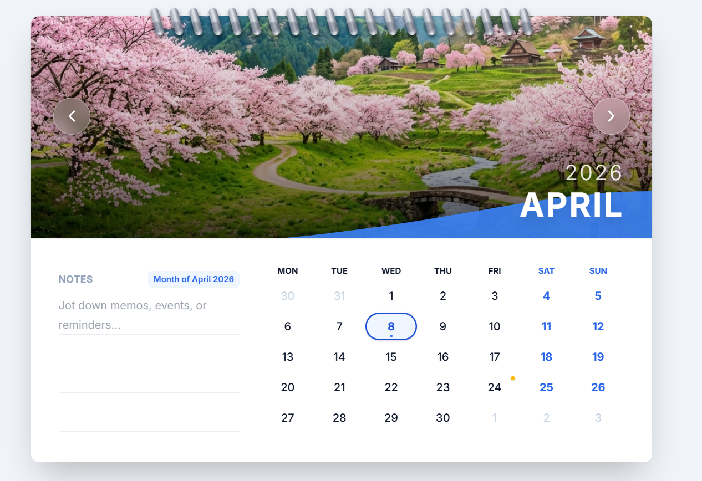
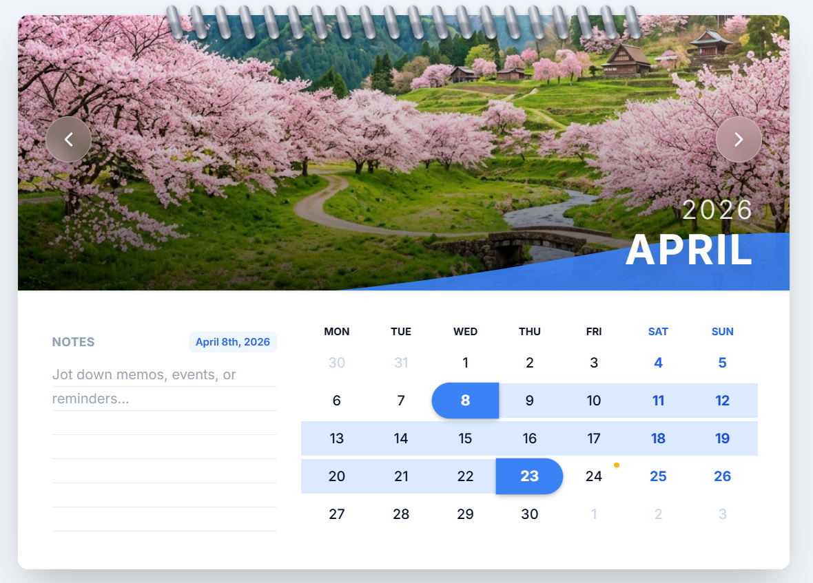
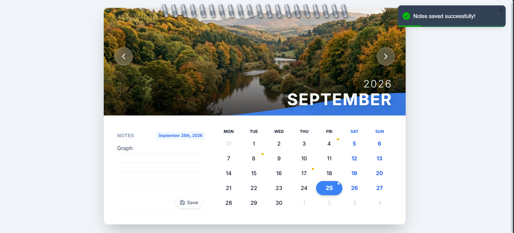
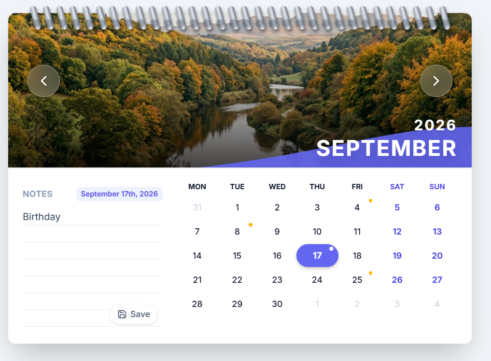

# Interactive Wall Calendar

## About the Project
This project is a fully responsive interactive wall calendar made using React. It is designed to feel like using a real paper calendar.

Users can easily move between different months, select single dates or a range of dates, and write notes for events, memories, or reminders in a dedicated notes section.

The calendar also includes a smooth 3D page-turn animation, similar to flipping a real calendar page. Each month displays different seasonal images, making the experience feel more real and visually appealing.

Overall, it combines useful features with a clean and engaging design to create a modern digital calendar experience.

### Visual Features In Action

**The Current Month View:**


**Date Range Selection:**


**Creating & Saving Notes:**


**Active Note Notification Dot:**


## Key Features & Highlights
* **3D Page Flipping:** Uses Framer Motion's advanced spring physics to simulate realistic flipping of completely unified pages around a static top metallic binding.
* **Persistent Local Storage:** Integrated with `localStorage` so notes tied to individual dates or entire months persist safely on refresh without needing a heavier database or backend framework.
* **Smart Highlight Dots:** Any date possessing saved notes intrinsically displays a bright amber notification dot mirroring physical sticky-note behavior beautifully. 
* **Seamless Date Selection:** Effortlessly handles standalone clicks and click-and-drag-style interval selections for picking multiday spans across the core grid structure cleanly mapping variables provided by `date-fns`.
* **Dynamic Header Themes:** Includes completely dynamic hero images corresponding smoothly with the seasonal month.

## Tech Stack
- **Framework**: React.js / Vite
- **Styling**: Tailwind CSS v4 styling structures and component layers for absolute responsive UI bounds.
- **Animations**: `framer-motion` for complex keyframe page flipping and 3D space tracking.
- **Date Component Management**: `date-fns` for lightweight, immutable locale logic, date math, and interval overlap functionality.
- **Icons & Toasting**: `lucide-react` for SVG UI components and `react-toastify` for clean, aesthetically pleasing save-confirmation popups.

## Setup & Installation

Follow these incredibly simple steps to run the calendar on your local machine:

1. **Navigate into the project directory:**
   ```bash
   cd calendar
   ```

2. **Install the node dependencies:**
   ```bash
   npm install
   ```

3. **Start the local development server:**
   ```bash
   npm run dev
   ```

4. Open your browser and instantly navigate to the localhost port provided in the terminal (usually `http://localhost:5173`).

---

### Developer Note
Designed and developed by **Rohan Jha**.
